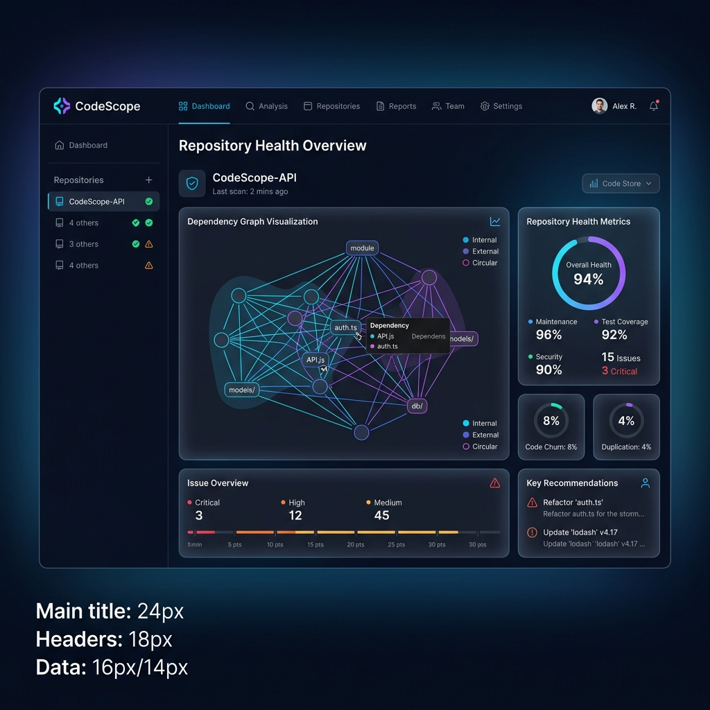

<div align="center">
  
# 🚀 CodeScope

**The Ultimate Codebase Analyzer & Repository Health Dashboard**

[](https://github.com/Jayanth182004/codescope)
[](https://www.python.org/downloads/)
[](https://reactjs.org/)
[](https://opensource.org/licenses/MIT)

---



</div>

## ✨ What is CodeScope?
CodeScope is a premium codebase analyzer and SaaS dashboard. It tracks repository health, indexes complex dependencies, and maps out architectural graphs using Neo4j and a sleek React interface. Understand your code at a glance, spot technical debt instantly, and visualize your entire project architecture like never before.

## 🚀 Get Started in 3 Short Steps

### 1. Clone & Install
```bash
git clone https://github.com/Jayanth182004/codescope.git
cd codescope
npm install      # Install frontend dependencies
pip install -r requirements.txt  # Install backend dependencies
```

### 2. Configure Environment
```bash
cp .env.example .env
# Open .env and set your database connection strings (PostgreSQL / Neo4j)
```

### 3. Spin it Up!
```bash
docker-compose up -d  # Starts the databases and backend
npm run dev           # Starts the gorgeous frontend dashboard
```
You're done! 🎉 Visit `http://localhost:5173` to explore your codebase.

---
*If you find this project useful, don't forget to ⭐️ **Star** this repository!*
